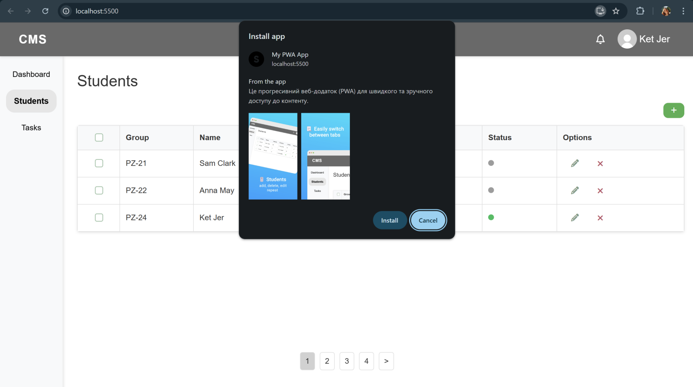
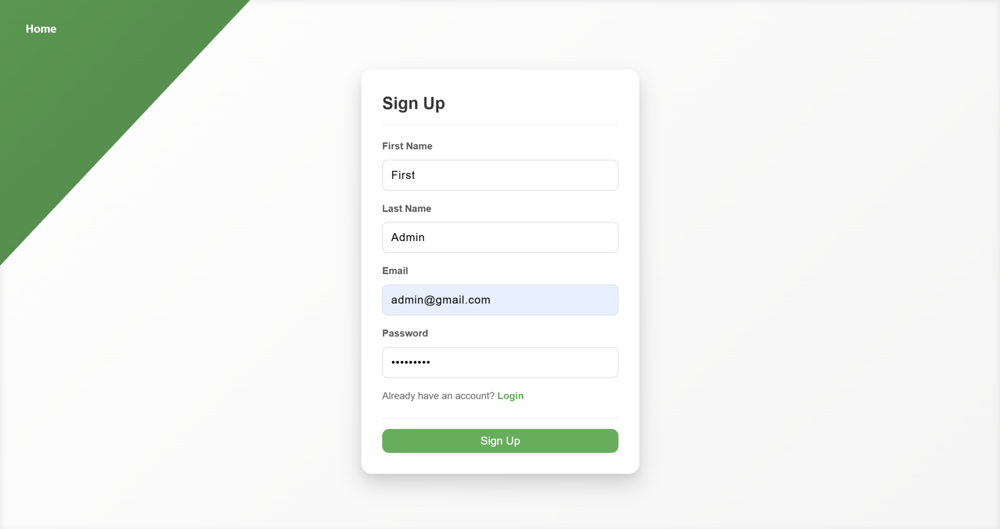
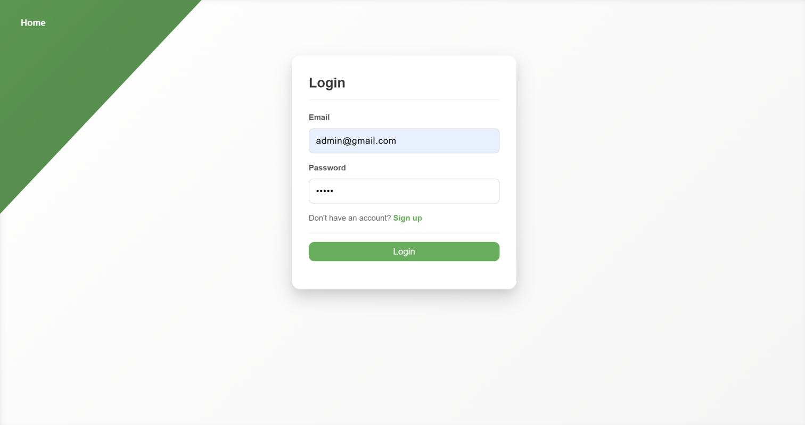
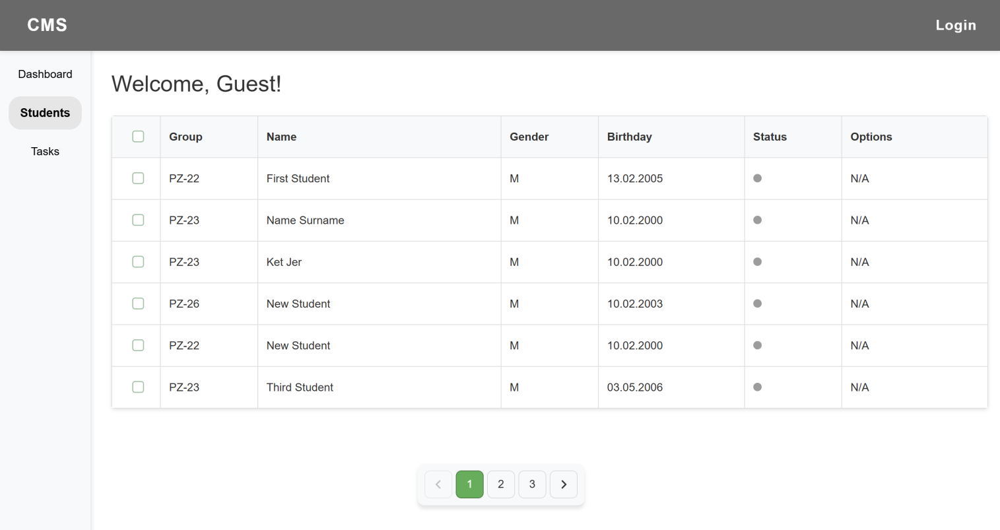
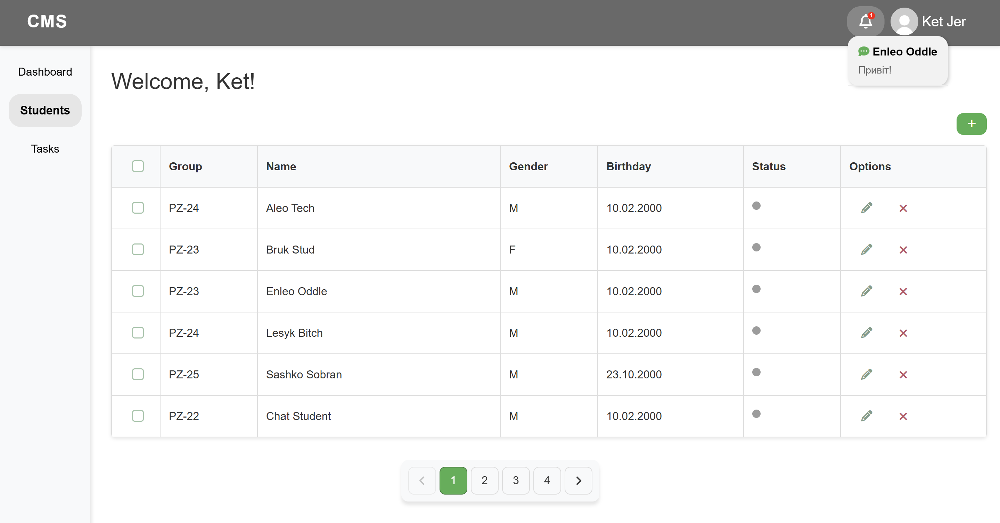
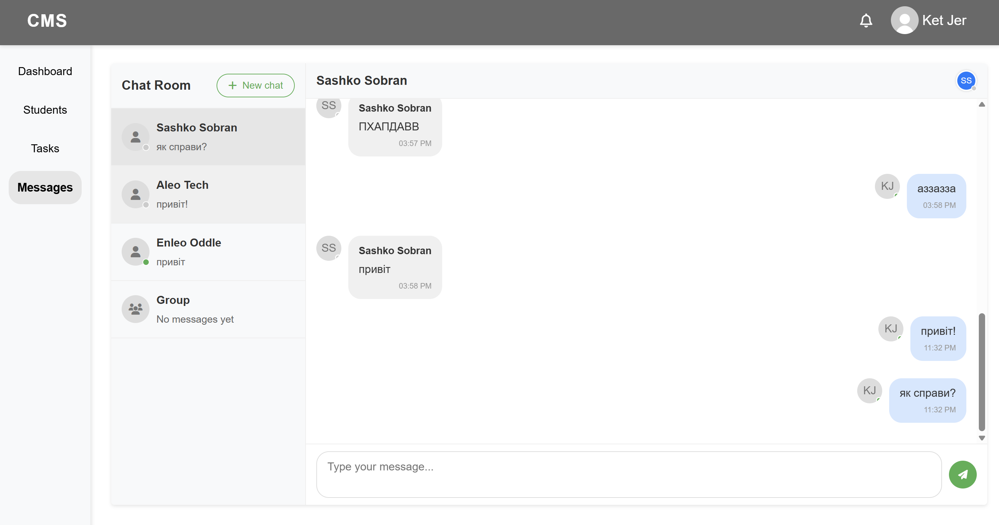
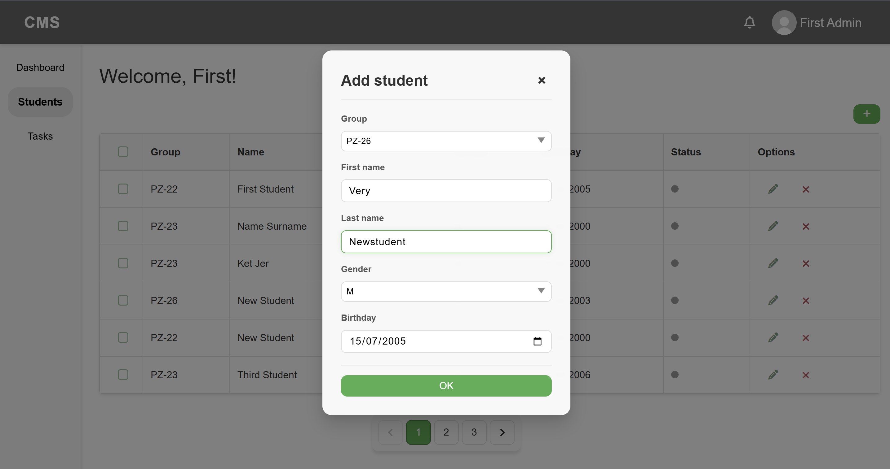
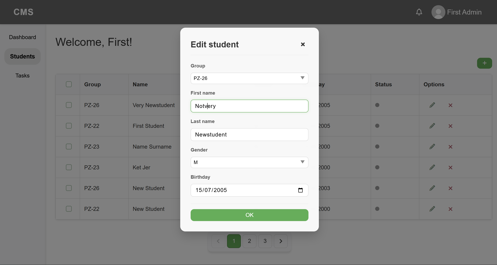
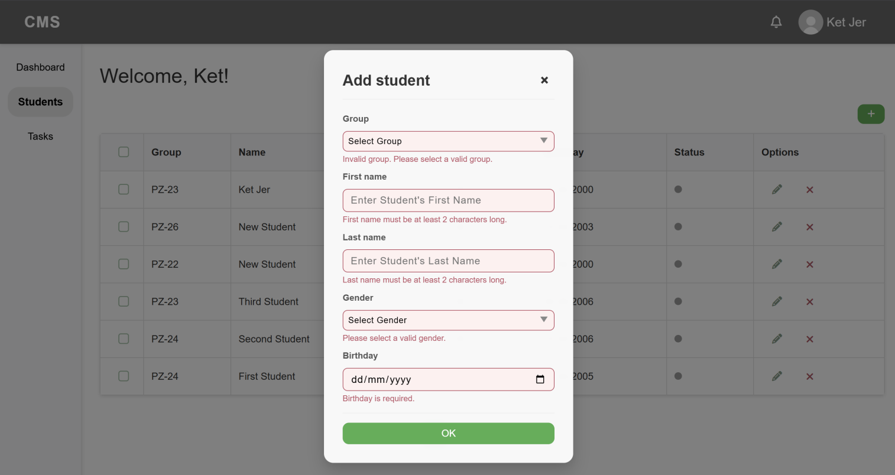

# 🎓 Student Monitor System

A comprehensive web application for educational institutions to **manage, monitor, and communicate with students**. This system combines student profile management with real-time messaging capabilities.

---

## 🚀 Features

### Student Management
- Add, edit, view, and delete student records
- Comprehensive profiles with personal details
- Status tracking and searchable student list
- Bulk actions for multiple students

### Real-time Chat System
- Private messaging between users
- Group chat capabilities with member management
- Real-time status indicators (online/offline)
- Message notifications
- Chat history

### Task Management
- Create and assign tasks to students
- Track task completion

### Dashboard
- Overview of key statistics and information

### User Authentication
- Secure login and registration system

### Responsive Design
- Works on both desktop and mobile devices

### Notifications
- Real-time notifications for new messages

---

## 🛠️ Technologies Used

### Frontend
- HTML5, CSS3
- JavaScript (Vanilla JS)
- Socket.io Client
- Progressive Web App (PWA) support

### Backend
- PHP
- Node.js
- Socket.io
- Express

### Databases
- MySQL (student data)
- MongoDB (chat messages, user status)

---

## ⚡ Installation

### Prerequisites
- PHP 7.4+ with MySQL
- Node.js and npm
- MongoDB

### Setup Steps

1. **Clone the repository**

```bash
git clone https://github.com/kateryna-havryshchuk/student-monitor.git
cd lab1
````

2. **Install PHP dependencies**

```bash
composer install
```

3. **Install Node.js dependencies**

```bash
npm install
```

4. **Configure databases**

* Set up MySQL database for student records
* Initialize MongoDB for the chat system:

```bash
node database/mongodb/init.js
```

5. **Configure environment settings**

Create a `.env` file with necessary configurations:

```env
PHP_APP_URL=http://localhost/lab1
DB_HOST=localhost
DB_USER=root
DB_PASS=yourpassword
DB_NAME=student_monitor
MONGODB_URI=mongodb://localhost:27017/chatdb
```

6. **Start the Socket.io server**

```bash
node public/server/server.js
```

7. **Run the PHP server (development)**

```bash
php -S localhost:8000
```
---

## 🎬 Usage

1. Register an account or login with existing credentials
2. Navigate through the dashboard to access different features
3. Add and manage student records through the Students page
4. Use the messaging system to communicate with students or other users
5. Create and assign tasks from the Tasks page

---

## 🖼️ Screenshots
<p align="center">
  
</p>
<p align="center">
  
</p>
<p align="center">
  
</p>
<p align="center">
  
</p>
<p align="center">
  
</p>
<p align="center">
  
</p>
<p align="center">
  
</p>
<p align="center">
  
</p>
<p align="center">
  
</p>
<p align="center">
  
</p>

---

## 🌐 Browser Support

* Chrome
* Firefox
* Safari
* Edge

---

## 🙏 Acknowledgements

* [Font Awesome](https://fontawesome.com/) for icons
* [Socket.io](https://socket.io/) for real-time communication
* [MongoDB](https://www.mongodb.com/) and [Mongoose](https://mongoosejs.com/) for chat database functionality

---

## 💻 Author

Kateryna Havryshchuk

